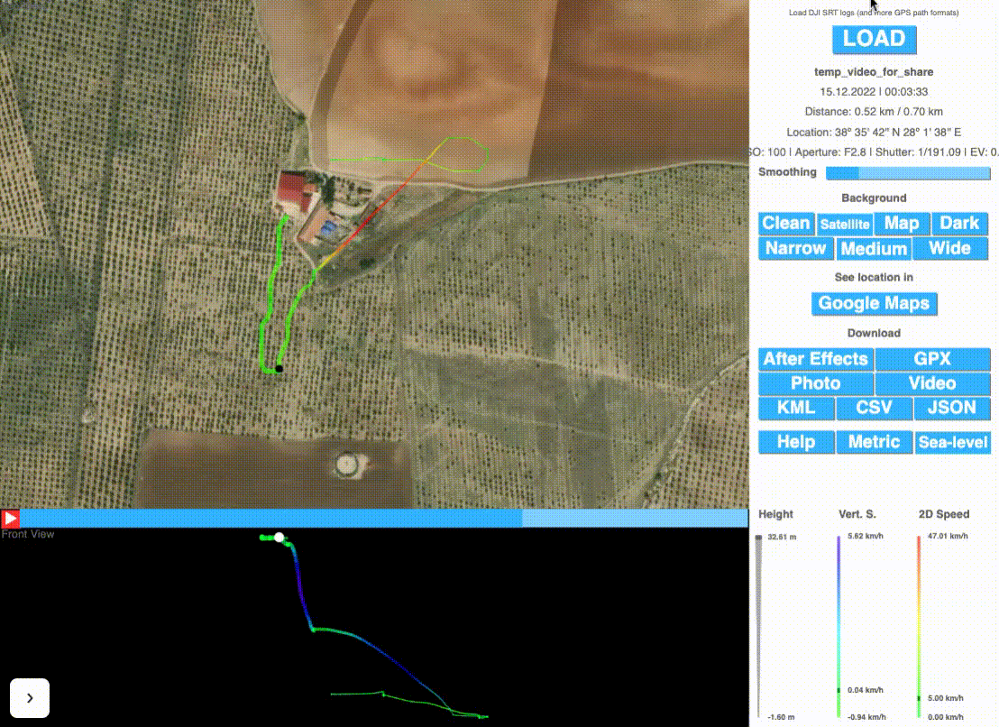

# Journal

Disclaimer: This document is my journal about this project. I am writing all my thoughts trials and errors. This is my way of thinking process. My mind is open-soured in a way. Please note that I am writing this document very fast and there may be too many typos like tis one.


#### 15.12.2022

- Today I have started this project however I had worked and tried to plan a bluprint in last couple of days. Finally the plan seems to be executable and here we are...
- The Story:
    - So last week I went to my family farm located near Salihli (Türkiye). It was the season to harvest the olives from the olive trees. The farm is contracted to another farmer so they are looking after the trees, collecting and seeling the olives by themselves in exchange of a rent fee. The problem with this setup is that there are very limited options for us to audit the contractor if they are looking after the trees and land well enough in the long run. Are they exploiding the trees to get too much yield or they are thinking for a long term try to sustain the trees. As a computer scientist like me it is very hard for me to evaluate their performance in the long run. So I am looking ways to measure proactivelly. During the harvest they were using a vibrating machine. The machine vibrates varius places of the tree and all the olives drops by themselfes so that they can collect with much less effort. There are varius debates that these kind of applications harms trees or it is beneficial for the tree. I do not know! However, it is for sure that we defninetlly need a lot of data about the farm and the progress so the contradictry debates can end and we can move forward in one sustainablle direction for common good. 
    - We have decided not to use the vibration machine but to make sure we need a system to follow the health of the trees individually. Afterall there were thousands (stragelly! this number is also debatable) of trees in the farm which is very hard to track manually. While I was thinking to solve it in a autmated way, I have started to search what I can do with my dji mavic mini drone. The idea is:
        - To shoot videos of every inch of the farm from the top
        - read the video with its geo location information and identified the trees with NN
        - keep them in an organized database with time record so that we can track the status (at least the size for now) of the tree
    - So with the following findings I think the tasks that I have listed above can be done.
- Deepforest -> [here](https://deepforest.readthedocs.io/en/latest/landing.html)  
    - I've started with the second bullet.
    - After couple of searches and fiddle around with [this](https://github.com/A2Amir/Counting-Trees-using-Satellite-Images) network, I've understand that a [Unet](https://en.wikipedia.org/wiki/U-Net) can accomplish task however that repo above is only publishing the network but not the trained model. However thet have a very good struture to train. That seemed promising, but I could not find a dataset to train for that. 
    - I have found [this](https://github.com/nightonion/yosemite-tree-dataset) dataset, however it needs to much slice trials and errors so I put it aside will use it if the other solutions are not working.
    - While I was looking for a dataset I accdiantlly bumped into DeepForest. Which is an open source project and they have a already traing model that can be easily called. They have even made it in a pip package. and a very very good documentation. Thank you... So I've decided to move with this. My discovery is [here](discovery.ipynb)
    - I have tried to predict the accuracy of the model with some samples that have been taken from my farm with my drone. I've discovered that if I some how resize the input image to a rectangle it almost predicts all trees with a reasable amount of miss. So the hardest part is actually been solved.
    - The framework has even an API that outputs the trees as list, and moreover I can append geo location to the list if I provide the images in geotiff format. This will be my identification mechanism for each tree.
- DJI
    - So after solving the hardest problem I started to look how I can extract geo location taged image from the drone.
    - after couple of searches:
        - https://forum.dji.com/thread-140031-1-1.html
        - https://djitelemetryoverlay.com/#products
        - https://djitelemetryoverlay.com/subtitle-extractor/#
        - https://djitelemetryoverlay.com/srt-viewer/
    - this free djitelemetryoverlay tool helped a lot. Thank you sooo much https://github.com/JuanIrache it is great work!...
        - so by exploring these tools I have discovered that actually the video that I shooted with my DJI mavic mini drone, (if you enable the video caption option from the setting before shoothing) records the telemetry data as caption of the video. you can extract with [this](https://djitelemetryoverlay.com/subtitle-extractor/#) tool and analyze the resulting SRT file with [this](https://djitelemetryoverlay.com/srt-viewer/) tool. Look How nice it is:
        
    - So my plan is to some how extract the SRT with my code from the video, and from thoese SRT and images of the video I will create geoTiff files for every second of the video. And I will input those geotiff files to deepforest to get the geo coded list of trees. the last part of the project is to identify the trees using these information and record them in a DB envonrment and all the management/reporting tools that which is another epic. 
    - To create a geotiff with python [this](https://gist.github.com/johannah/f5ff6c09a11c0081383aae755f4f7b7b) might help
        - this code also uses [gdal](https://gdal.org/download.html#development-source) which I need a conda environment to install on my development. So I did that succesfully.
    - So I am looking for ways how to extract SRT from the video by code. I've checked the Juan's repo library but there seems to be no repo for that.
        - watched [this](https://www.youtube.com/watch?v=Lf9ZikB8aJ4) it is already saying that I had discovered by now.
        - I am searching towards [this](https://www.google.com/search?client=safari&rls=en&q=opencv+read+subtitles&ie=UTF-8&oe=UTF-8) direction
            - while looking I've bumped into [this](https://theailearner.com/2018/10/15/extracting-and-saving-video-frames-using-opencv-python/) which I may use to read the video file any way.
        - every solution is about extracting the harcoded subtitle which involves with a lot of OCR buiseness. I do not need that. I have already soft srt data attached to the video. I just simple couple of lines how to read srt which is already there. no luck yet.
        - I am running out of time for today so I will continue later after I am commiting everything.

#### 20.12.2022        

-  extract SRT from the video by code
    - So I've decided to reverse engineer [this](https://djitelemetryoverlay.com/subtitle-extractor/#) 
        - failed to do that! the files wont format properlly.
    - I am looking the API of opencv try to see if there is anything to read the captions.
    - when I am searching how to extract the metadata of a video I've bumper into [this](https://www.thepythoncode.com/article/extract-media-metadata-in-python), however I am getting ffprobe file not found error.
        - I found [this](https://stackoverflow.com/questions/57350259/filenotfounderror-errno-2-no-such-file-or-directory-ffprobe-ffprobe) solution. I need to install the ffmepeg on the computer. python installation may not be enough.
        - Ok I have installed and moved the ff commands into bin of the treecounter environment and it worked
        - however, there is no subtitle information in that result.
        - More interestinglly the resulting probe has attributes called caption and it is 0. as if video has no caption. however I can view the captions in VLC. but not in quicktime.
    - I've mailed Juan, maybe he can help...

#### 21.12.2022

- So I've got response from Juan. Thank you so much for help. [Here](https://superuser.com/questions/583393/how-to-extract-subtitle-from-video-using-ffmpeg) is his forward.
    - Now this is worked, but how can I read it into memory but not into file.
    ```
    ffmpeg -i ~/Downloads/temp_video_for_share.mp4  -map 0:s:0 data/subs.srt
    ```
    - [This](https://stackoverflow.com/questions/69218400/how-to-use-multiple-map-values-in-ffmpeg-python) might help for code version. well could not understand fully how can implement into my project.
    - I need to pipe completelly all the way to the deepforest. instead of input ouput seperatelly.
- Now I have another problem, my discovery notebook stoped working. it locks the kernel while I am executing the deepforest.